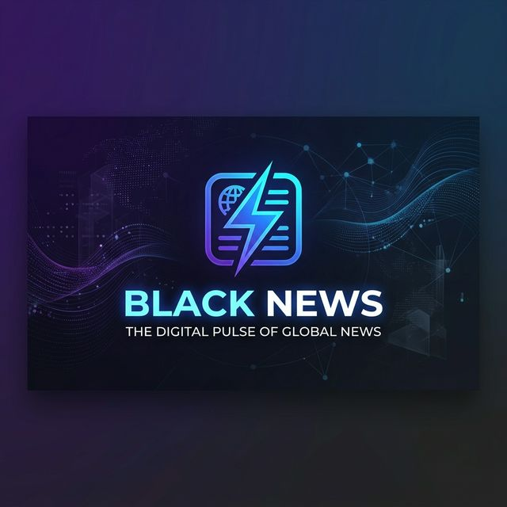

# <p align="center"></p>

<p align="center">
  
  
  
  
</p>

---

**Black News** is a premium, high-performance web application that uses state-of-the-art Artificial Intelligence to generate professional-grade news articles on any topic instantly. Built with a sleek, modern aesthetic and a focus on privacy and speed, it supports multiple AI providers including **Google Gemini, OpenAI, OpenRouter, Cohere, and Mistral**.

## ✨ Key Features

### 🤖 Multi-Provider AI Integration
Switch between five major AI providers with a single click. Each provider has its own independent API key storage, allowing you to use the best model for your needs.
*   **Google Gemini** (gemini-2.0-flash) — *Recommended for Speed*
*   **OpenAI** (gpt-4o-mini) — *Industry Standard*
*   **OpenRouter** — *Access any model including free tiers*
*   **Cohere** — *Professional writing quality*
*   **Mistral** — *High-performance open-weight models*

### 🎨 Premium Design & UX
*   **Glassmorphism UI:** A stunning, modern interface with blurred backgrounds and sleek borders.
*   **Dark & Light Modes:** Intelligent theme switching with system preference detection.
*   **Micro-Animations:** Smooth transitions, skeleton loaders, and tactile button effects.
*   **Article History:** Your generated news is saved locally in your browser for later reading.

### 📱 Full PWA Support
*   **Installable:** Add Black News to your home screen or desktop as a standalone app.
*   **Offline Ready:** Service workers cache core assets for lightning-fast loading.
*   **Mobile First:** Perfectly responsive design that looks great on any screen size.

### 🔒 100% Privacy-First
*   **No Backend:** Everything runs entirely in your browser using client-side JavaScript.
*   **Secure API Keys:** Your keys are stored only in `localStorage` and are **never** sent to any third-party server besides the AI provider you selected.

---

## 🚀 Getting Started

### 1. Requirements
You only need a modern web browser. No installation or account creation is required for the app itself.

### 2. Get an API Key
Choose your preferred AI provider and get a key:

| Provider | Registration Link | Notes |
| :--- | :--- | :--- |
| **Google Gemini** | [AI Studio](https://aistudio.google.com/apikey) | **Free** tier available (Highly recommended) |
| **OpenRouter** | [OpenRouter Keys](https://openrouter.ai/keys) | Access free models like Gemini 2.0 Flash Lite |
| **Mistral AI** | [Mistral Console](https://console.mistral.ai/api-keys) | Excellent small models available |
| **Cohere** | [Cohere Dashboard](https://dashboard.cohere.com/api-keys) | Great for descriptive long-form content |
| **OpenAI** | [OpenAI Platform](https://platform.openai.com/api-keys) | Requires a paid account with credit balance |

### 3. Usage
1.  **Select Provider:** Choose your AI model in the "API Configuration" section.
2.  **Paste Key:** Insert your API key and click **Save Key**.
3.  **Choose Topic:** Pick one of the 8 categories or type a custom topic.
4.  **Generate:** Select the number of articles and hit **⚡ Generate News**.

---

## 🛠️ Technical Overview

### Tech Stack
*   **Frontend:** HTML5, Modern CSS (Custom Properties, Flexbox, Grid)
*   **Logic:** Vanilla JavaScript (ES6+) — *Zero dependencies*
*   **Connectivity:** Fetch API for direct AI provider communication
*   **Persistence:** LocalStorage for keys, theme, and history
*   **Performance:** Service Workers (`sw.js`) and Web App Manifest (`manifest.json`)

### File Structure
```text
Black_News/
├── index.html     # Main entry point & structure
├── style.css      # Design system & responsive styles
├── app.js         # Core application logic & API handlers
├── sw.js          # Service Worker for offline/PWA support
├── manifest.json  # PWA configuration
├── banner.png     # Project branding
└── icon-512.png   # App icon
```

---

## 🏗️ Deployment Guide (GitHub Pages)

Black News is designed to be hosted for free on GitHub Pages:

1.  **Fork** or clone the repository to your GitHub account.
2.  Go to **Settings** → **Pages**.
3.  Under **Build and deployment**, select:
    *   **Source:** Deploy from a branch
    *   **Branch:** `main` (or yours) → `/ (root)`
4.  Wait for the build to complete. Your app will be live at `https://yourusername.github.io/Black_News/`.

---

## ⌨️ Keyboard Shortcuts

*   `Ctrl + Enter`: Instantly generate articles.
*   `Escape`: Close the history panel or any active modal.

---

## 📄 License

Distributed under the **MIT License**. See `LICENSE` for more information.

---

<p align="center">
  
  <br>
  Built with ❤️ for a smarter, faster news experience.
</p>
